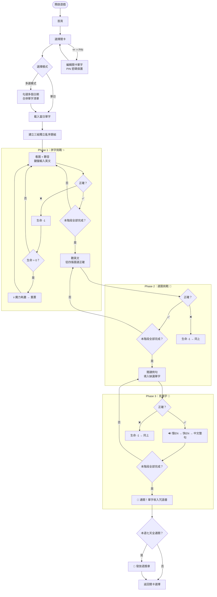
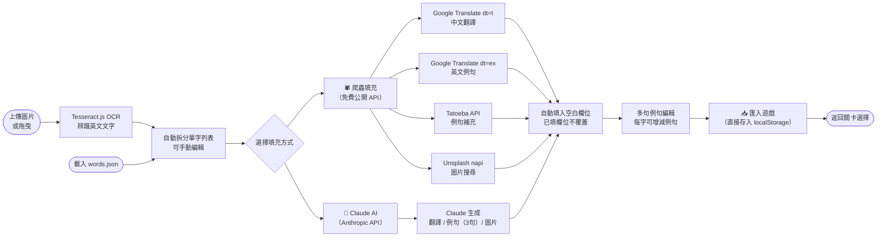
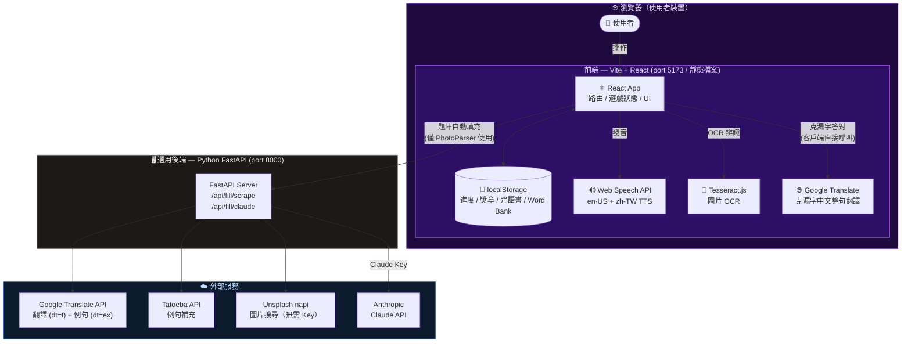

# 🏰 魔法學院英語遊戲 — EnglishCard

> 為小學生設計的魔法主題英語單字學習遊戲。透過三種關卡挑戰，收集咒語書頁、贏得學院獎章！

---

## ✨ 功能特色

| 功能 | 說明 |
|------|------|
| 🔡 拼字挑戰 | 看圖聽音，鍵盤輸入英文單字 |
| 🖼️ 選圖挑戰 | 聽英文發音，從四張圖中選出正確答案 |
| 📜 克漏字挑戰 | 閱讀英文例句，填入缺漏的單字；答對後依序朗讀「慢英文 → 快英文 → 中文整句」 |
| 💀 魂系機制 | 三條命，答錯三次魔力耗盡，當關重來 |
| 📚 咒語書 | 通關後單字自動收錄，永久保存 |
| 🏅 週獎章 | 七天全數通關自動發放週獎章 |
| ☑️ 多選關卡 | 可同時選取多個日期合併挑戰，通關後每天分別標記完成 |
| 📷 題庫工具 | OCR 辨識 + 爬蟲/AI 自動填充，直接匯入遊戲 |
| ✏️ 關卡編輯 | PIN 密碼保護，在關卡選擇頁點 ✏️ 即可編輯當日單字 |
| 🔊 TTS 發音 | Web Speech API，支援 en-US 英文及 zh-TW 中文朗讀 |

---

## 🛠 技術棧

```
前端                           後端（選用）
──────────────────────         ─────────────────────
Vite + React 18 + TypeScript   Python FastAPI
Tailwind CSS v4                httpx（網路爬取）
Framer Motion                  Anthropic SDK (Claude AI)
React Router v6
Vitest + React Testing Library
Web Speech API (TTS)
Tesseract.js (OCR)
localStorage（持久化）
```

---

## 🗂 專案結構

```
EnglishCard/
├── start.bat                   # 🟢 一鍵啟動（雙擊即可）
├── public/
│   └── data/
│       └── words.json          # 預設題庫
├── src/
│   ├── types/index.ts          # WordEntry, GameSession, PhaseState…
│   ├── data/
│   │   ├── loader.ts           # groupByDate 等工具
│   │   └── sampleWords.ts      # 開發範例資料
│   ├── store/
│   │   ├── gameReducer.ts      # 遊戲狀態機（3 Phase）
│   │   └── GameContext.tsx     # React Context / startMultiLevel
│   ├── hooks/
│   │   ├── useTTS.ts           # speakClozeSequence / speakTwice
│   │   └── useGameSession.ts   # Context hook
│   ├── utils/
│   │   ├── wordBank.ts         # localStorage CRUD + replaceWordsByIds
│   │   ├── csvParser.ts        # CSV → WordEntry[]
│   │   ├── weekUtils.ts        # ISO 週計算
│   │   └── ocr.ts              # Tesseract.js wrapper
│   ├── components/
│   │   ├── ui/                 # Button, Modal, HeartBar…
│   │   └── game/               # SpellingChallenge, TranslationChallenge, ClozeChallenge
│   └── pages/
│       ├── HomePage.tsx
│       ├── LevelSelectPage.tsx  # 多選模式 + PIN 保護編輯
│       ├── GamePage.tsx
│       ├── WeeklyChallengePage.tsx
│       └── tools/PhotoParserPage.tsx
├── server/
│   ├── main.py                 # FastAPI 自動填充後端
│   ├── requirements.txt
│   └── start.bat               # 僅啟動後端
├── vite.config.ts
└── vitest.config.ts
```

---

## 🎮 遊戲流程



---

## 📷 題庫製作工具流程



---

## 🏗 部署架構



> **注意**：後端僅在使用「自動填充」功能時需要啟動。遊戲本體（含克漏字中文朗讀）完全離線可用；Google Translate 克漏字翻譯需網路，失敗時自動降級為單詞翻譯。

---

## 🚀 快速開始

### 前置需求

- Node.js 18+
- Python 3.10+（選用，僅題庫自動填充需要）

### 一鍵啟動（推薦）

直接雙擊專案根目錄的 **`start.bat`**，自動同時開啟：
- 前端視窗 → `http://localhost:5173`
- 後端視窗 → `http://localhost:8000`

或從終端機執行：

```bash
npm run dev:all
```

### 手動啟動

```bash
# 安裝前端依賴
npm install

# 啟動前端
npm run dev
# → http://localhost:5173

# 啟動後端（另開終端機，選用）
cd server && start.bat
# → http://localhost:8000
```

### 建置生產版本

```bash
npm run build
# 輸出至 dist/，可部署至任何靜態主機（Nginx、GitHub Pages、Netlify…）
```

---

## 📦 題庫格式

題庫工具會直接寫入 localStorage（`englishcard_wordbank`），也支援匯入 JSON 檔案。

### JSON 格式

```json
[
  {
    "id": "w001",
    "word": "apple",
    "translation": "蘋果",
    "imageUrl": "https://...",
    "date": "2026-03-16",
    "sentence": "I eat an ___ every day.",
    "sentences": [
      "I eat an ___ every day.",
      "The ___ is red and sweet."
    ]
  }
]
```

| 欄位 | 必填 | 說明 |
|------|------|------|
| `id` | ✅ | 唯一識別碼（格式隨意） |
| `word` | ✅ | 英文單字 |
| `translation` | ✅ | 中文翻譯 |
| `imageUrl` | ✅ | 圖片網址 |
| `date` | ✅ | 所屬日期 `YYYY-MM-DD`（決定關卡分組） |
| `sentences` | ☑️ | 多個克漏字例句，每句含 `___`；克漏字時隨機抽取 |
| `sentence` | ☑️ | 單一例句（向下相容舊格式） |

### CSV 格式

欄位：`id, word, translation, imageurl, date, sentences`（`sentences` 欄位以 `;` 分隔多句）

---

## 🔒 關卡編輯 PIN 密碼

| 項目 | 說明 |
|------|------|
| 預設密碼 | `0000` |
| 格式 | 4 碼英數字（大小寫不分） |
| 修改方式 | 題庫製作工具 → ⚙️ 設定 → 修改編輯密碼 |
| 儲存位置 | `localStorage: englishcard_pin` |

---

## 🧪 測試

```bash
# 執行全部測試
npm test

# 監看模式
npm run test:watch
```

**測試涵蓋範圍（37 tests）：**

| 測試檔 | 涵蓋內容 |
|--------|----------|
| `utils/csvParser.test.ts` | CSV 解析、錯誤處理、引號逸脫 |
| `utils/weekUtils.test.ts` | ISO 週計算、邊界值 |
| `store/gameReducer.test.ts` | 三階段狀態機、生命值、通關判定 |
| `components/game/SpellingChallenge.test.tsx` | 答對/答錯/Enter 鍵/大小寫 |
| `hooks/useTTS.test.ts` | `speakTwice` 回呼、`speakClozeSequence` 三段佇列 |

---

## 🎨 主題配色

| 用途 | 顏色 |
|------|------|
| 背景主色 | `purple-950` |
| 強調金色 | `amber-300 / amber-400` |
| 咒語光暈 | `rgba(168, 85, 247, 0.5)` |
| 正確回饋 | `green-400` |
| 錯誤回饋 | `red-400` |

---

## 📝 授權

MIT License
